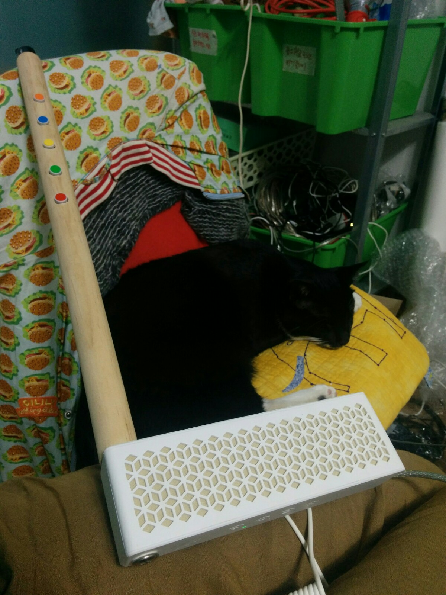
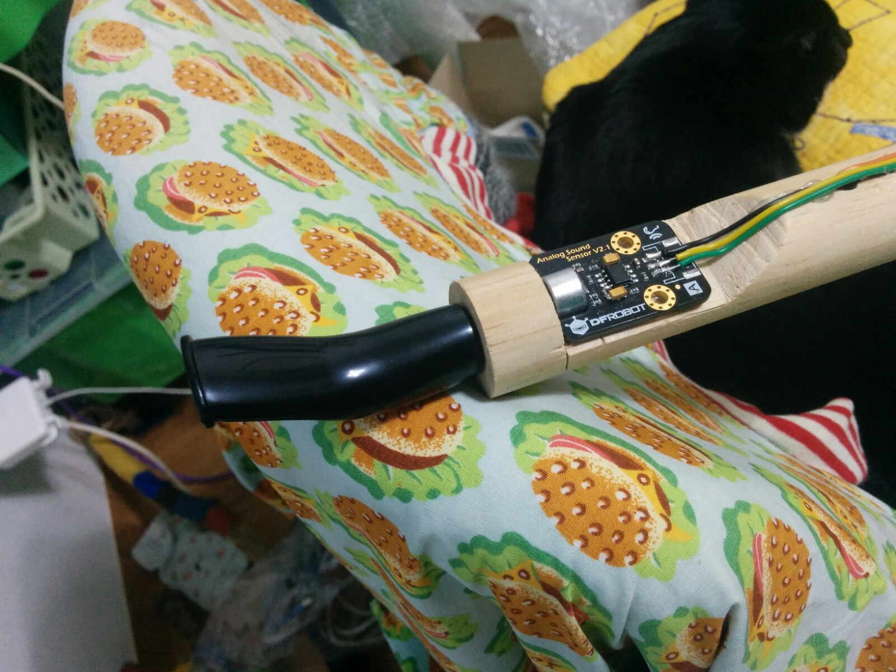
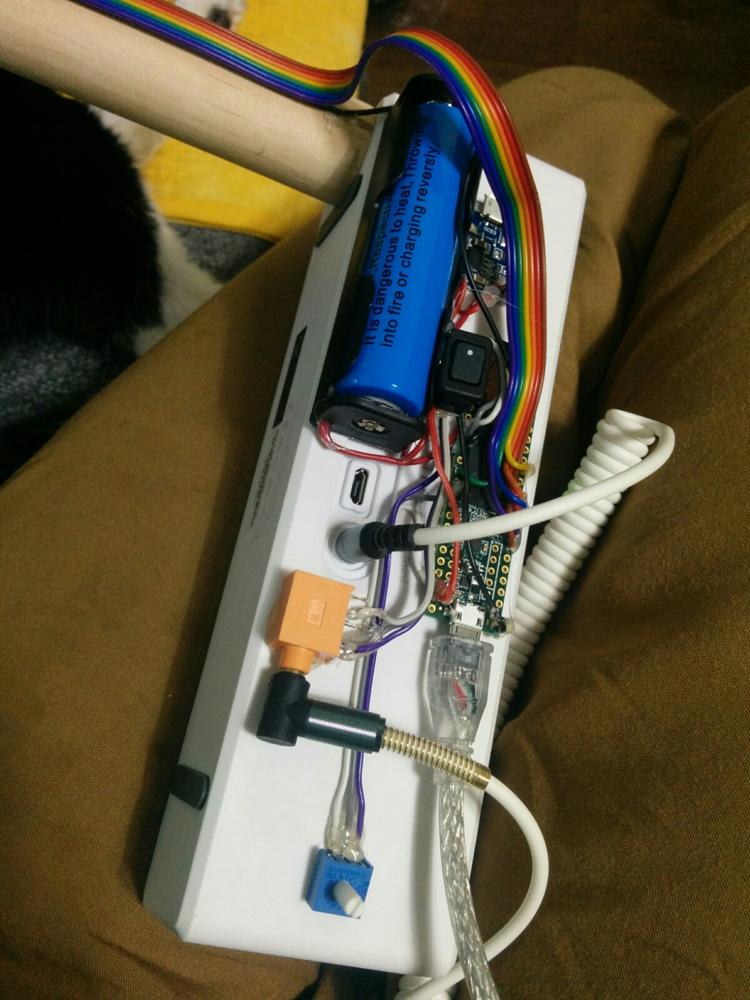
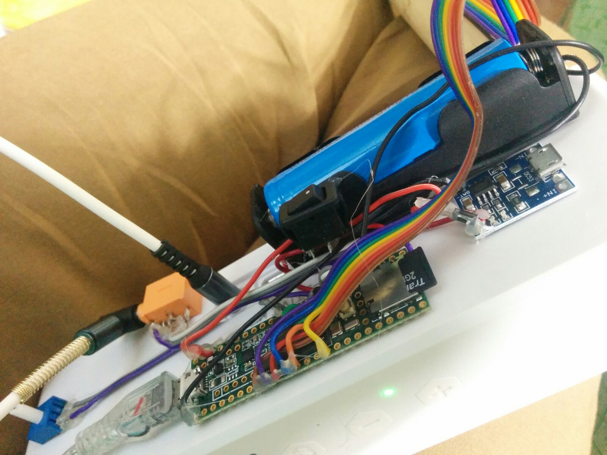
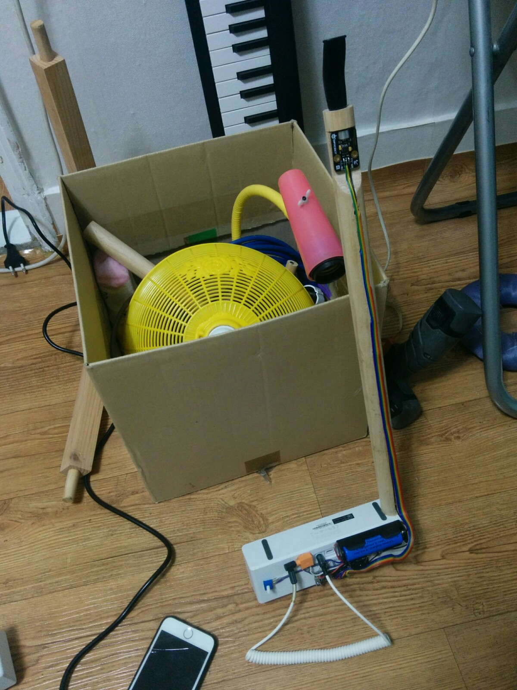

# wavplayer5

## what it is?

play some wav files when you press a button AND blow into the microphone

## what was fun?

- teensy 3.5 with onboard SD card slot!
- using TeensyThreads: multi-threading!
- teensy 3.5 stereo DAC output!

yeeeeeees :)

## how's it look like?

